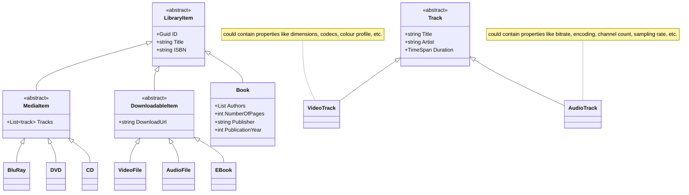
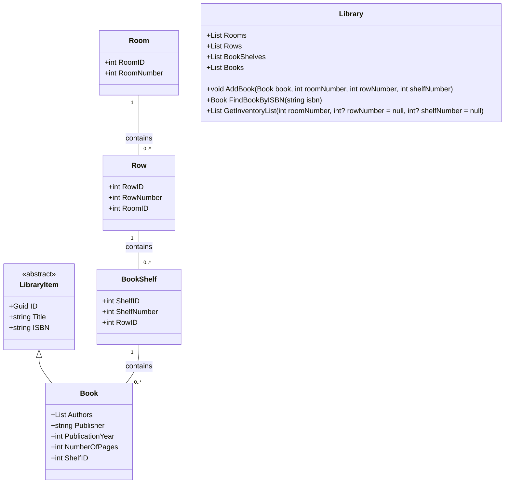

[](https://github.com/githappens/backend-case/actions/workflows/test-runner.yml)

# Problem definition
Please find below a set of three exercises that require skills within object oriented design and programming. You will be asked to design a class diagram, create text parsers, organize data in collections and establish test cases.

The time frame for completing the exercises is 2 hours.

The subsequent interview will be based on your results, and the dialog will concern how you have solved the exercises, the methods you have chosen, the reason for your choice and the reason for deselecting other methods, how you would have solved the exercises if you had to choose a different method etc. The bottom line here is not so much about the accuracy of your results, but your capability to defend your choices and deselections.

Have fun!

## Exercise 1.1

Design a set of types that represent the items that can be borrowed at a library.

This library offers books, CDs, DVDs and Blue-ray discs, and some titles can be downloaded into a file as e-books, audio or video files.

All kinds of items have a title and a unique ISBN identifier. Books have an author and contain a number of pages, whereas CDs, DVDs and Blue- ray discs can hold multiple tracks of audio or video each having a separate title and artist as well as a duration.

Your task is to design a set of types that can be used to retrieve the information mentioned above representing these various kinds of items. Please use constructs such as inheritance, interfaces and virtual/abstract functions as you deem appropriate and focus on public members defining the accessible surface of each type. You do not need to actually code the implementation of any methods and you also do not need to deal with the different file formats for downloading.

Diagrams are appreciated. Note if you create the classes in this part of the exercise you can reuse them in the later parts.

## Exercise 1.2

Consider the following text input, describing entries in a library

```
Book:
Author: Brian Jensen
Title: Texts from Denmark
Publisher: Gyldendal
Published: 2001
NumberOfPages: 253
Book:
Author: Peter Jensen
Author: Hans Andersen
Title: Stories from abroad
Publisher: Borgen
Published: 2012
NumberOfPages: 156
```

Create a method that will successfully enter these books into the following data structure

```csharp
class Book
{
  public List<string> Authors= new List<string>();
  public string Publisher;
  public int PublicationYear;
  public int NumberOfPages;
}
```

with the following signature

```csharp
List<Book> ReadBooks(string input);
```
Furthermore create a function with the signature

```csharp
List<Book> FindBooks(string searchString);
```
that will search for books and supports the following types of search strings:

- “\*20\*” should return all books containing 20 in the Title, Authors, Publisher or in the PublicationYear (‘20’, ‘200’, 120 etc)
- “\*20\* & \*peter\*” => books that satisfy \*20\* and also \*peter\*

Here the string \& is the literal & and the & is a Boolean operation joining the two queries.

## Exercise 1.3

### Problem

A library has a large collection of books organized in different rooms, rows and book-shelves that are all numbered.

The local librarian is working on an application in which he can register the books and make inventory lists for a given room, row or book-shelf. Also it must be possible to locate a given book by its ISBN number.

### Exercise

- Create an object model that is able to represent the necessary entities.
- Establish a small set of test data.
- Add necessary object collections to enable efficient creation of the inventory lists and locating books.
- Create objects and populate collections with the test data. Insertion speed of new books is not relevant.
- Establish a set of test-cases that verifies the solution against the test data.

# Class Diagrams
## 1.1 & 1.2

## 1.3
